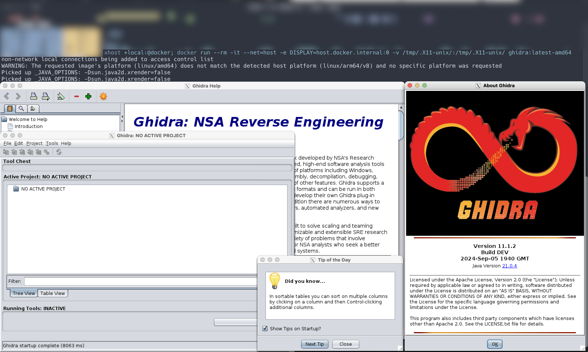

# ghidra-wolfi

This repo contains the mechanisms to build an experimental variant of Ghidra as an APK via Melange and an OCI image to consume that APK via Apko.




This process results in a functional version of Ghidra with minimal CVEs.

Requirements:

- [Melange](https://github.com/chainguard-dev/melange) (Package)
- [Apko](https://github.com/chainguard-dev/apko) (Image)

Build process (`x86_64` for now; `aarch64` may or may not work reliably):

1. `melange keygen`
2. `melange build --arch x86_64 ghidra.yaml --signing-key melange.rsa`
3. `apko build ghidra.apko.yaml ghidra:latest ghidra.tar`
4. `docker load < ghidra.tar`
5. `xhost +local:@docker; docker run --rm -it --net=host -e DISPLAY=host.docker.internal:0 -v /tmp/.X11-unix/:/tmp/.X11-unix/ ghidra:latest-amd64`

The image is built with `DISPLAY=:0` but may need to be overridden depending on the OS. For macOS, [XQuartz](https://www.xquartz.org/) is required; `xhost + 127.0.0.1` may also be required.

> On macOS, the `Allow connections from network clients` box in the Security menu needs to be checked within the XQuartz Settings as well.

When the image is run, the following console output is expected:

```
non-network local connections being added to access control list
WARNING: The requested image's platform (linux/amd64) does not match the detected host platform (linux/arm64/v8) and no specific platform was requested
Picked up _JAVA_OPTIONS: -Dsun.java2d.xrender=false
Picked up _JAVA_OPTIONS: -Dsun.java2d.xrender=false
```

after which the Ghidra UI will be visible. The container uses `tail -f /dev/null` to run indefinitely.

CVE scan:

```
grype c47ada55ad4d
 ✔ Vulnerability DB                [no update available]
 ✔ Loaded image                                                                                                                                                                 c47ada55ad4d
 ✔ Parsed image                                                                                                      sha256:c47ada55ad4dcf61299878cc156ea6a2354f0765fa8484c5111ba5a267f66233
 ✔ Cataloged contents                                                                                                       4ffabb572ac0d38fae31b7f15dda78c3fe2a50d777932e4402b2629b5e9f550e
   ├── ✔ Packages                        [303 packages]
   ├── ✔ File digests                    [5,915 files]
   ├── ✔ File metadata                   [5,915 locations]
   └── ✔ Executables                     [208 executables]
 ✔ Scanned for vulnerabilities     [18 vulnerability matches]
   ├── by severity: 0 critical, 4 high, 13 medium, 1 low, 0 negligible
   └── by status:   16 fixed, 2 not-fixed, 0 ignored
[0006]  WARN unexpectedly empty matches for archive '/usr/bin/ghidra/Ghidra/Processors/68000/lib/68000.jar'
[0006]  WARN unexpectedly empty matches for archive '/usr/bin/ghidra/Ghidra/Processors/68000/lib/68000.jar'
[0006]  WARN unexpectedly empty matches for archive '/usr/bin/ghidra/Ghidra/Processors/8051/lib/8051.jar'
[0006]  WARN unexpectedly empty matches for archive '/usr/bin/ghidra/Ghidra/Processors/8051/lib/8051.jar'
[0007]  WARN unable to resolve java package identifier from purl="pkg:maven/@11.1.2": name is required
[0007]  WARN unable to resolve java package identifier from purl="pkg:maven/@11.1.2": name is required
NAME                    INSTALLED     FIXED-IN        TYPE          VULNERABILITY        SEVERITY
bcprov-jdk15on          1.69                          java-archive  GHSA-wjxj-5m7g-mg7q  Medium
bcprov-jdk15on          1.69          1.78            java-archive  GHSA-v435-xc8x-wvr9  Medium
bcprov-jdk15on          1.69          1.78            java-archive  GHSA-m44j-cfrm-g8qc  Medium
bcprov-jdk15on          1.69                          java-archive  GHSA-hr8g-6v94-x4m9  Medium
bcprov-jdk15on          1.69          1.78            java-archive  GHSA-8xfc-gm6g-vgpv  Medium
commons-compress        1.21          1.26.0          java-archive  GHSA-4g9r-vxhx-9pgx  High
commons-compress        1.21          1.26.0          java-archive  GHSA-4265-ccf5-phj5  Medium
commons-configuration2  2.8.0         2.10.1          java-archive  GHSA-xjp4-hw94-mvp5  Medium
commons-configuration2  2.8.0         2.10.1          java-archive  GHSA-9w38-p64v-xpmv  Medium
commons-net             3.2           3.9.0           java-archive  GHSA-cgp8-4m63-fhh5  Medium
guava                   31.0.1-jre    32.0.0-android  java-archive  GHSA-7g45-4rm6-3mm3  Medium
guava                   31.0.1-jre    32.0.0-android  java-archive  GHSA-5mg8-w23w-74h3  Low
netty-handler           4.1.86.Final  4.1.94.Final    java-archive  GHSA-6mjq-h674-j845  Medium
protobuf-java           3.17.3        3.19.6          java-archive  GHSA-g5ww-5jh7-63cx  High
protobuf-java           3.17.3        3.19.6          java-archive  GHSA-4gg5-vx3j-xwc7  High
protobuf-java           3.17.3        3.19.6          java-archive  GHSA-h4h5-3hr4-j3g2  Medium
```
